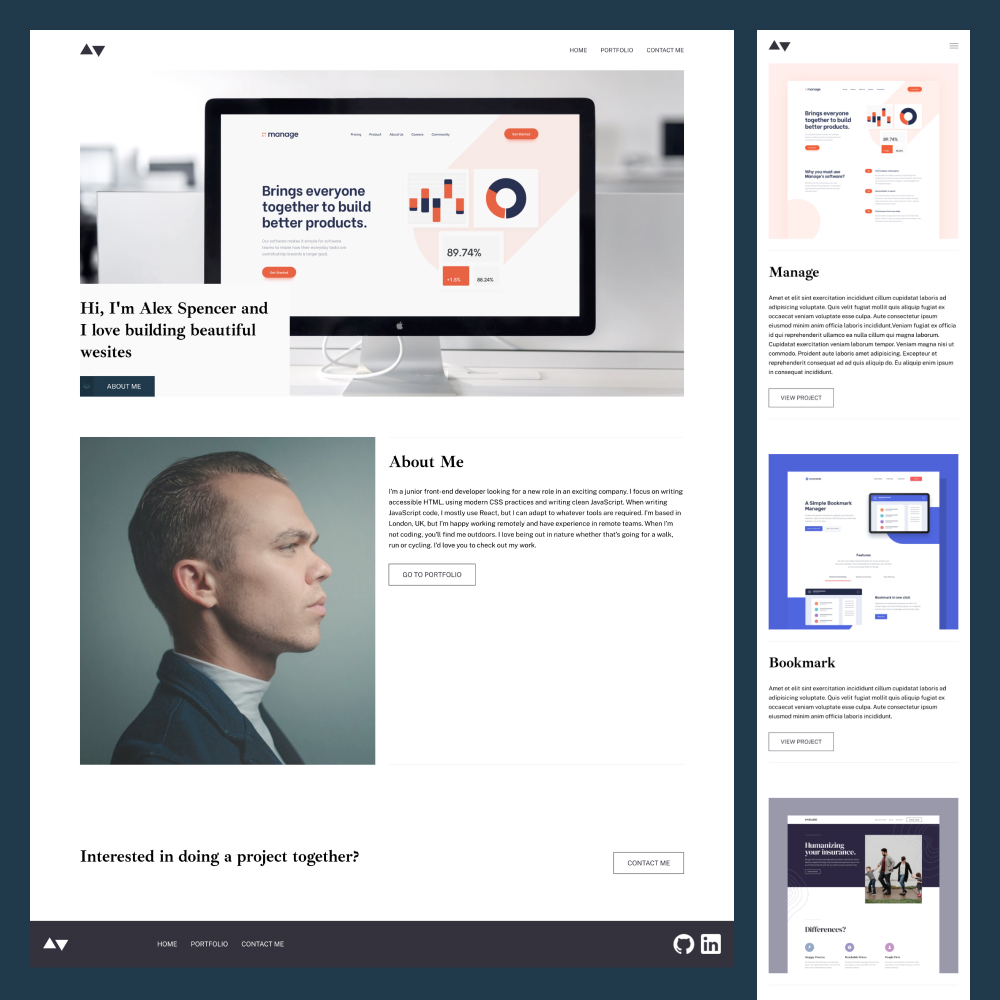

# Frontend Mentor - Minimalist portfolio website solution

This is a solution to the [Minimalist portfolio website challenge on Frontend Mentor](https://www.frontendmentor.io/challenges/minimalist-portfolio-website-LMy-ZRyiE). Frontend Mentor challenges help you improve your coding skills by building realistic projects.

## Table of contents

- [Overview](#overview)
  - [Screenshot](#screenshot)
  - [Links](#links)
- [My process](#my-process)
  - [Built with](#built-with)
  - [What I learned](#what-i-learned)
  - [Continued development](#continued-development)
  - [Useful resources](#useful-resources)
- [Author](#author)
- [Acknowledgments](#acknowledgments)

## Overview

### Screenshot

Screenshot of live website: 

### Links

- Live website URL [Minimalist Portfolio:](https://minimalist-portfolio-erikdcodes.vercel.app/)

## My process

### Built with

- [React](https://reactjs.org/) - JS library
- [Next.js](https://nextjs.org/) - React framework
- [Styled Components](https://styled-components.com/) - For styles
- Mobile-first workflow
- Semantic HTML5 markup
- CSS custom properties
- Flexbox / Grid

## Author

- Website - Erik De Jesus
- Github - [@erikdcodes](https://github.com/erikdcodes)
